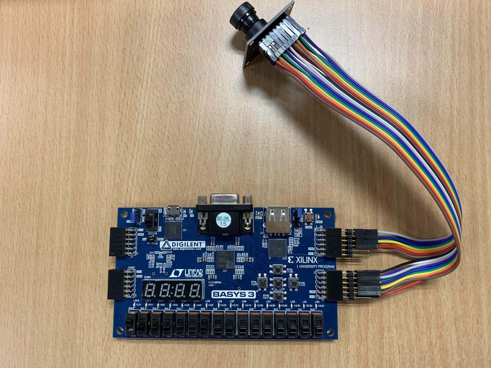

# ov7670_vga_display

## Purpose: 
Read OV7670 Camera to BASYS3 FPGA, and VGA output to LCD

## Top module
camera_vga_display_top.v

## Constraint file
ov7670_vga.xdc

## FPGA Board
Design for Basys3 FPGA board

## Functions
1. Setup OV7670 via SCCB interface
2. read OV7670 camera at 320x240 resolution due to RAM size limit in Basys 3
3. Output to VGA port

## Connection

